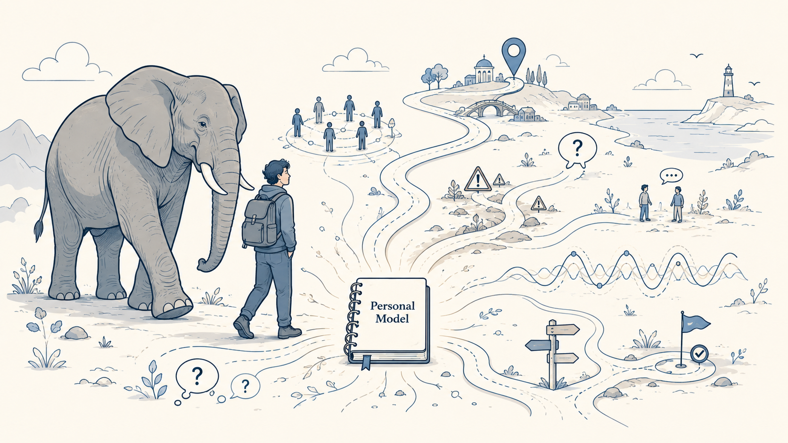
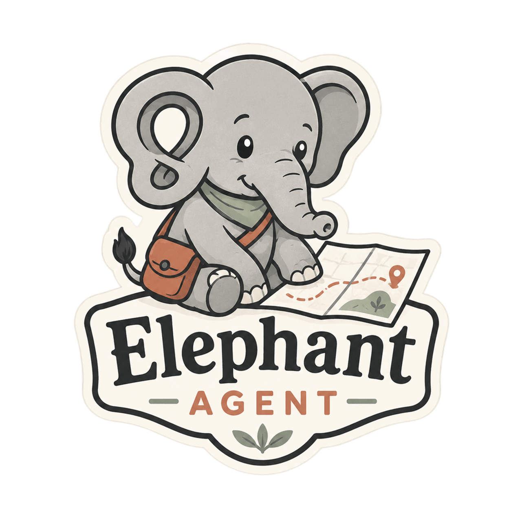
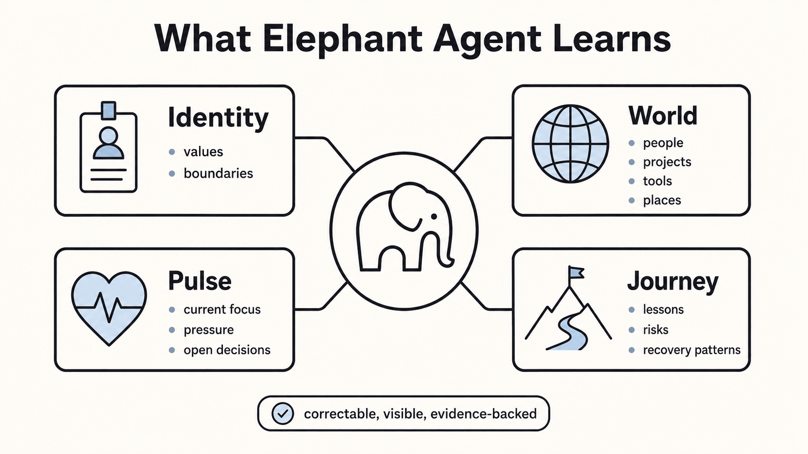

<p align="center">
  
</p>

<div align="center">
  <h1>Elephant Agent</h1>
  <p>
    <strong>Elephants never forget.</strong><br />
    Personal-Model-first self-evolving AI agent · Curiosity at your pace · Reflect after the turn.
  </p>
  <p>
    <a href="https://elephant.agentic-in.ai/">Website</a>
    ·
    <a href="https://elephant.agentic-in.ai/blog/personal-ai-you-create/">Blog</a>
    ·
    <a href="https://elephant.agentic-in.ai/paper/">Paper</a>
  </p>
</div>


## Why an Elephant?

<p align="center">
  
</p>


The old saying is close to true, but the beautiful part is not storage.
Elephants remember **with meaning**.

They recognize companions by sight and smell, remember danger cues, and return
to important places long after the last visit. Older matriarchs can guide a herd
through hard seasons because memory has become **practical judgment**: who is
safe, where water may be found, and which warning signs deserve attention.

That is the inspiration for Elephant Agent: memory that becomes **care**,
**context**, and **better judgment**.

## From Elephant Memory to Personal AI

Most AI still asks you to **begin again**. You explain the same project, the same
people, the same constraints, the same decisions, and the same hard-won lessons.
Longer context windows help for a while, but they do not solve the deeper
problem: a personal AI should know **which memories are worth carrying forward**.

Elephant Agent is built around that idea. It does not try to preserve every
transcript. It grows a **correctable understanding** of the **paths**, **people**,
**risks**, **rhythms**, and **decisions** that should shape future help.

- It **remembers less**, but **understands deeper**.
- It **picks up the right thread** instead of replaying the whole past.
- It **asks gently** when one missing answer would change how it helps.
- It **shows evidence**, accepts correction, and lets silence stand.
- It becomes **more yours over time** because its understanding stays tied to you,
  not just to the current task.

This is the self-evolving part: Elephant Agent does not evolve by collecting
more transcripts or blindly adding skills. It evolves around you as curiosity
and background reflect jobs turn lived evidence into a clearer, correctable
Personal Model.

One `elephant` is a durable companion for a line of work or life context. Many
elephants form a `herd`.

## What Elephant Agent Learns

Elephant Agent is not trying to collect a complete profile. It learns what has durable
value for future help:

<p align="center">
  
</p>

| Lens | What it carries forward |
|---|---|
| **Identity** | Stable self-description, values, decision style, boundaries, and durable preferences. |
| **World** | Projects, people, tools, places, vocabulary, and relationships that shape your context. |
| **Pulse** | Current focus, active pressure, recent constraints, mood patterns, and temporary priorities. |
| **Journey** | Past experiences, lessons, failures, recovery patterns, and long-running growth. |

That learning comes from four loops:

- **Grounded learning** from explicit remembers, corrections, and dashboard edits.
- **Curiosity-driven learning** from one useful question when a gap would change future help.
- **Reflect-driven background learning** from agents that read Episode steps after close, idle, diary, or manual triggers.
- **Skill fit learning** from visible capability use while keeping durable understanding inspectable.

## Curiosity, At Your Pace

At `elephant init`, you choose how curious your Elephant Agent should be:

| Curiosity effort | What it feels like |
|---|---|
| **Quiet** | Elephant Agent mostly waits and asks rarely. |
| **Balanced** | Elephant Agent asks at natural pauses when the answer would help. |
| **Active** | Elephant Agent is more willing to check in and learn, while staying optional. |

Every question belongs to a Personal Model lens and exists for a reason: a gap,
a conflict, a stale pulse, or an adaptation that would improve future help.
Questions are visible and dismissible. Silence always wins.

## You stay in control

Open the dashboard to see and shape what Elephant Agent understands:

- **You** — active Identity, World, Pulse, and Journey claims.
- **Why** — evidence behind a claim, shown when you inspect it.
- **Questions** — open, asked, answered, and dismissed curiosity prompts.
- **Evidence** — the trail behind understanding, not hidden prompt truth.

You can correct or forget claims, answer or dismiss questions, and keep Elephant Agent’s
understanding aligned with who you are now.

## Quickstart

Install Elephant Agent, create your first named elephant, then come back through `wake` whenever
you want to continue.

### Install

```bash
curl -fsSL https://elephant.agentic-in.ai/install.sh | bash
```

### First run

```bash
elephant init        # choose identity, provider, and curiosity effort
elephant herd new    # create another named elephant when you need one
elephant wake        # enter the chat TUI
elephant dashboard   # open You, Questions, and Evidence
```

## How It Deepens

| Day 1 | Week 1 | Month 1 | Month 3 |
|---|---|---|---|
| It knows your first anchors | It knows the project and people in view | It asks better questions and explains why | It has grown into your rhythms, with evidence you can inspect |

## Paper and blog

README and the homepage stay product-first. The deeper system story lives here:

- [Read the paper →](https://elephant.agentic-in.ai/paper/)
- [Read the blog →](https://elephant.agentic-in.ai/blog/personal-ai-you-create/)

## Contributors

<p align="center">
  
</p>

<p align="center">
  <bold>
    Agentic Intelligence Lab
  </bold>
</p>
