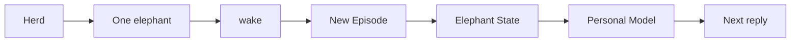

# Continuity

Continuity is the difference between an agent that feels disposable and one that can pick up the thread without asking you to start over.



## Herd and wake

```bash
elephant wake
elephant herd new demo
elephant herd
elephant herd use demo
elephant herd delete demo
elephant wake --elephant-id demo
elephant wake --elephant-id demo --message "Who are you?"
```

Use a new elephant only when you want a second continuity line. Most of the time, return to the same elephant through `wake`.

| Command | Use it when... |
| --- | --- |
| `elephant wake` | Continue the current elephant. |
| `elephant herd` | See every known elephant. |
| `elephant herd use <name>` | Switch the default wake target. |
| `elephant herd new <name>` | Start a separate continuity line. |
| `elephant wake --elephant-id <name>` | Open one elephant directly without switching defaults. |

## What persists

| Persisted object | Purpose |
| --- | --- |
| Elephant identity | Names the continuity line. |
| Current context note | Gives the next Episode a compact resume point. |
| Episodes and Steps | Preserve the source trail for audit, replay, and learning. |
| Personal Model claims | Carry Identity, World, Pulse, and Journey understanding. |
| Provenance links | Explain why claims exist. |
| Personal Model questions | Keep useful missing pieces visible. |

Elephant State is intentionally not a blocker board. If a live task needs visible steps, use task/todo tooling; durable user understanding belongs in the Personal Model.

## Inspect continuity

Inside `wake`, slash commands such as `/status`, `/tools`, and `/skills` help
inspect the active runtime. The local dashboard is the place to inspect Personal
Model claims, provenance, questions, herd, and history.

:::tip
Good continuity is allowed to say `no_match`. An honest gap is better than a
confident invented memory.
:::

## Continuity surfaces

| Surface | What it contributes |
| --- | --- |
| CLI / Chat TUI | Main durable conversation path. |
| Dashboard | Visual inspection and correction. |
| Messaging | Extends the same elephant into configured IM surfaces. |
| Jobs / Reflect | Maintains understanding outside the immediate reply. |
| History | Lets you inspect the source trail when something feels off. |
