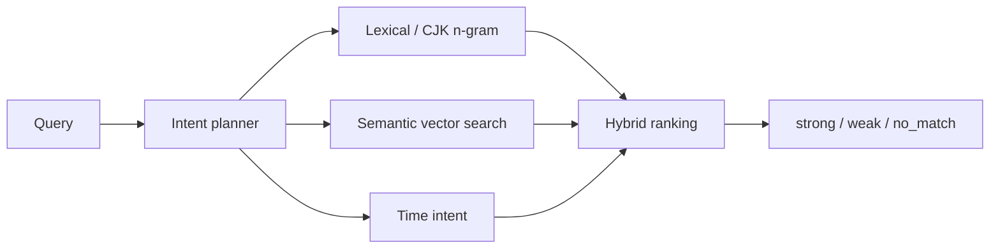

# Embeddings

Embeddings help Elephant Agent recover meaning when words change. They are part
of contextual recall and search, not a replacement for the Personal Model.

## Why embeddings matter

Personal context is multilingual, indirect, and time-sensitive. The same idea
may appear as a Chinese note, an English command, a project nickname, or a
conversation fragment from weeks ago.

Embeddings give Elephant Agent a semantic path through that material while the
Personal Model keeps durable truth correctable.

## Local default

Elephant Agent includes a local semantic recall path by default.

| Piece | Role |
| --- | --- |
| `elephant-local-embed` | Local embedding provider selection. |
| `elephant-embeddings-v1-text-small` | Compact local model used for semantic retrieval. |
| 64 / 256 / 768 dimensions | Different latency and depth postures from the same model family. |
| normalized vectors | Stable similarity behavior across retrieval paths. |

:::note Local-first recall
The local default means claim and conversation retrieval can run without sending
personal context to an external embedding provider.
:::

## Retrieval posture



| Signal | Why it exists |
| --- | --- |
| Lexical and exact match | Protects precise names, IDs, and explicit phrases. |
| CJK n-grams | Helps mixed Chinese/English recall without a global alias table. |
| Semantic search | Recovers meaning when wording changes. |
| Time intent | Respects explicit windows and recency/historical intent. |
| Match status | Prevents weak similarity from becoming false memory. |

## Provider override

The default is local. Advanced operators can configure one OpenAI-compatible
embedding override when they intentionally want an external embedding endpoint.

```bash
elephant provider embeddings status
elephant provider embeddings local
elephant provider embeddings openai-compatible \
  --base-url https://api.example.com/v1 \
  --model text-embedding-3-large \
  --dimensions 1536 \
  --api-key "$OPENAI_API_KEY"
```

| Mode | Use it when... | Tradeoff |
| --- | --- | --- |
| Local | You want private, built-in recall. | Smaller model, local resource use. |
| OpenAI-compatible override | You need a specific embedding endpoint or larger dimension. | External service and credential management. |

## Boundary with memory

Embeddings answer: **what is semantically nearby?**

The Personal Model answers: **what should Elephant Agent treat as current
understanding?**

That boundary is why retrieval can be powerful without turning every retrieved
chunk into truth.

