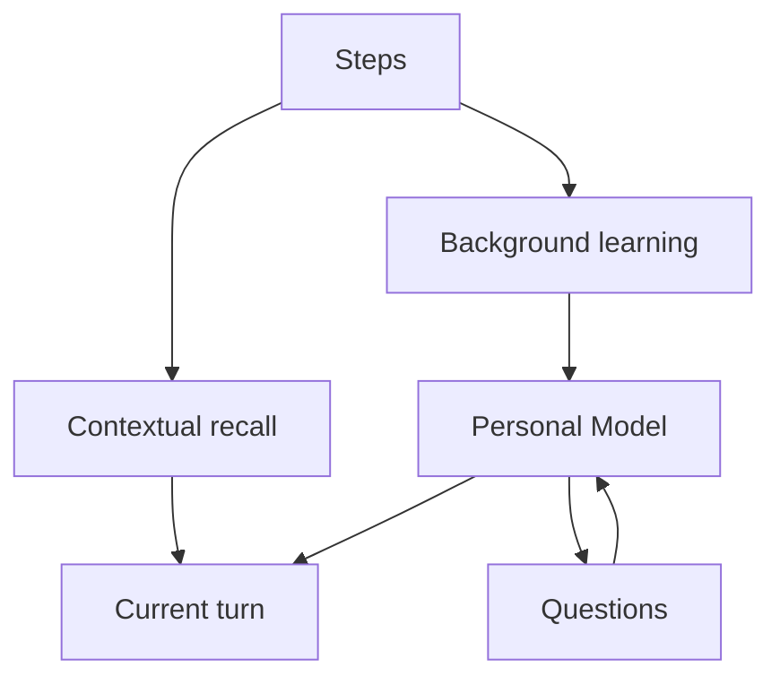

# Memory

Elephant Agent memory is not one bucket. It is a layered system that separates
durable understanding from runtime trace, current-turn support, and background
learning.

:::note
Recall is part of memory, but memory is not reduced to recall. A retrieved Step
can support the current turn; it becomes durable understanding only when a
governed update writes through the Personal Model.
:::

## Memory layers

| Layer | What it remembers | How to inspect it |
| --- | --- | --- |
| **Personal Model** | Active, retired, and disputed claims across Identity, World, Pulse, Journey. | Dashboard You / Diary / Why views. |
| **Elephant State** | Elephant identity and one current context note. | Herd, status, wake resume. |
| **Episode / Loop / Step trail** | Inputs, replies, tool calls, results, updates, and provenance. | History, runtime trace, Why inspection. |
| **Contextual recall** | Current-turn support retrieved from facts and Steps. | `/recall`, diagnostics, search result status. |
| **Background learning** | Episode-close, diary, dream, grounding, and skill-affinity updates. | Reflect, jobs, learning results. |

## Claim-aware recall

Personal Model search returns claims with match status. It does not pretend that
every old note is support.

`tool.personal_model.search` can combine:

- topic, claim, and source-support field matches
- Unicode lexical matching and CJK n-grams
- weak fuzzy matching for small spelling or character variation
- semantic retrieval from the durable index
- optional translated or paraphrased `query_variants`
- lightweight polarity checks for clear preference statements

| Status | Meaning | How Elephant Agent should behave |
| --- | --- | --- |
| `strong_match` | The Personal Model contains reliable support. | Use the claim with appropriate confidence. |
| `weak_match` | The result is relevant but not strong enough to overstate. | Mention uncertainty or ask if needed. |
| `no_match` | There is no reliable Personal Model support. | Do not fabricate memory. |

Exact lookup can use `mode=exact` and a `topic`. Conceptual lookup can use
`mode=semantic` and `query_variants`. Verification can use `mode=verify`, which
is stricter than normal lookup.

## Current-turn recall

When a current turn needs past support, Elephant Agent may inject a
`Current-turn recall support:` block.

| It can do | It cannot do |
| --- | --- |
| Bring relevant evidence into this turn. | Become Personal Model truth by itself. |
| Explain why a reply is grounded. | Override an active corrected claim. |
| Return `no_match` honestly. | Invent a memory when support is weak. |

:::warning Not durable truth
Current-turn recall support is useful evidence. It is not a hidden permanent
memory write.
:::

## Inspect understanding in practice

Use the dashboard You page to inspect and correct claims, Questions to manage
useful prompts, and Why views to trace the support material behind them.
Diagnostics can explain why a search matched or returned `no_match`; they are for
inspection and debugging, not prompt truth.

## Related pages

- [Embeddings](./embeddings.md) for local semantic retrieval and provider posture.
- [Correctable understanding](../learning/correctable.md) for remember, correct, forget, and dispute.
- [Background learning](../learning/background.md) for episode close, diary, dream, and reflect jobs.
