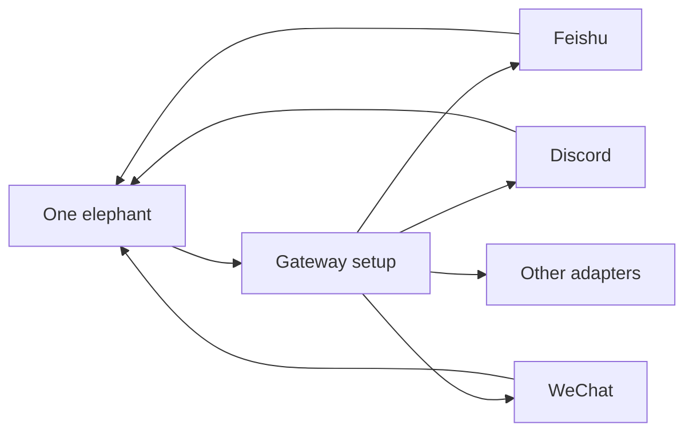

# Messaging

Messaging lets Elephant Agent extend a durable continuity line into IM surfaces without
turning the website or docs into a claim that every channel is always active by
default.



## How messaging works

| Step | What happens |
| --- | --- |
| Start in the CLI | Use the local runtime as the source of truth. |
| Choose the elephant | Bind the IM surface to one continuity line. |
| Configure gateway | Store explicit adapter wiring. |
| Start the bridge | Bring the messaging surface online. |
| Inspect status | Use dashboard Messaging or gateway commands. |

## Core commands

```bash
elephant gateway setup
elephant gateway doctor
elephant gateway describe
elephant gateway feishu start --transport long-connection --detach
elephant gateway feishu status
elephant gateway feishu logs ops-feishu --follow
elephant gateway discord setup --account-id ops-discord --bot-token-env-var ELEPHANT_DISCORD_BOT_TOKEN
```

## Design intent

Messaging is a delivery adapter for a durable elephant, not a second product
architecture. The continuity still belongs to the elephant and its underlying
State. The adapter just lets that same continuity line show up in another
configured surface.

:::note
If you switch messaging identities, treat it as a continuity decision. The
important question is which elephant should carry the thread.
:::
