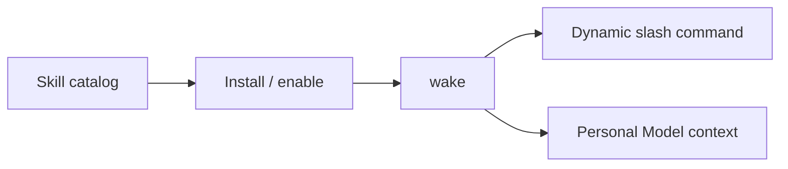

# Skills

Skills are reusable workflow packages that help Elephant Agent handle specialized tasks
more effectively. They sit above the base runtime and make repeatable operator
flows easier to discover, inspect, and install.

:::note
Skills are capabilities around the Personal Model. They help Elephant Agent do
work, but they do not become a hidden second profile.
:::

## What skills do

| Skill role | What it means |
| --- | --- |
| Domain instruction | A skill can teach Elephant Agent how to approach a domain or workflow. |
| Operator workflow | A skill can expose a repeatable command or process. |
| Inspectable package | A skill can be viewed, installed, enabled, or disabled explicitly. |
| Affinity signal | Background learning may notice which skills fit the user, but the skill remains visible. |

## Where skills show up

Outside `wake`, use:

- `elephant skills`
- `elephant skills active`
- `elephant skills search <query>`
- `elephant skills view <skill-id|reference>`
- `elephant skills install <skill-id|source:reference|/path/to/skill>`

Inside `wake`, use:

- `/skills`
- `/skills active`
- `/skills search <query>`
- `/skills view <skill-id|reference>`
- `/skills install <skill-id|source:reference|/path/to/skill>`

Matching skill packages can also expose dynamic slash commands such as
`/apple-notes ...`.

## Built-in and external skills

The packaged CLI ships with a bundled skill catalog. The public website mirrors
that catalog in [Skills](/skillhub/), but that page is a release-facing shelf,
not a hosted marketplace. Extra public skills remain an explicit operator-owned
install flow.
