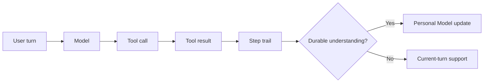

# Tools

Tools are the executable surface that lets Elephant Agent search, inspect, edit, run,
and communicate while staying grounded in one local runtime.

:::warning Visible actions
Tools should stay inspectable. If a tool changes durable understanding, that
change should pass through explicit Personal Model update paths.
:::

## Built-in tool families

The built-in runtime already exposes:

<!-- BEGIN:GENERATED_BUILTIN_TOOL_SUMMARY -->
- `terminal`: `tool.terminal.exec`
- `process`: `tool.process.manage`
- `file`: `tool.file.read`, `tool.file.write`, `tool.file.patch`, `tool.file.search`
- `web`: `tool.web.search`, `tool.web.read`, `tool.web.extract`
- `browser`: `tool.browser.navigate`, `tool.browser.snapshot`, `tool.browser.click`, `tool.browser.type`, `tool.browser.scroll`, `tool.browser.back`, `tool.browser.press`, `tool.browser.images`, `tool.browser.vision`, `tool.browser.console`
- `clarify`: `tool.clarify`
- `cron`: `tool.cron.manage`
- `code_execution`: `tool.code.execute`
- `personal_model`: `tool.personal_model.search`, `tool.personal_model.update`, `tool.personal_model.questions`
- `messaging`: `tool.message.send`
- `todo`: `tool.todo.manage`
- `skills`: `tool.skill.list`, `tool.skill.view`, `tool.skill.manage`
- `sub_agents`: `tool.sub_agents`
<!-- END:GENERATED_BUILTIN_TOOL_SUMMARY -->

## How tools fit the product story

| Principle | What it means |
| --- | --- |
| Visible, not hidden magic | Tool calls are part of the runtime trail. |
| Conversation stays primary | Tools support the reply; they do not replace the relationship. |
| Durable work | Tool results can become provenance for later learning. |
| Claim-aware search | Personal Model search returns match status instead of pretending every query has support. |

Inside `wake`, `/tools` keeps the current catalog inspectable without leaving
the conversation.
