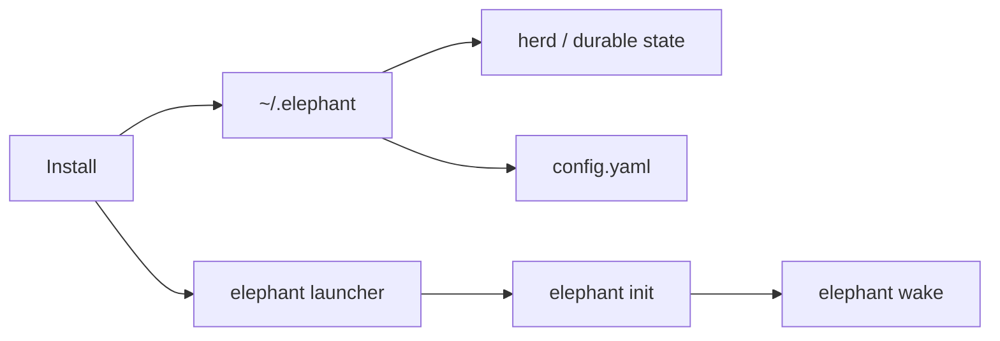

# Installation

Installation should leave you with one local runtime, one `elephant` launcher,
and one durable herd that future sessions can return to. The normal path is the
public installer; the repo-local path is only for development.

## Choose an install path

| Path | Use when | What it gives you |
| --- | --- | --- |
| Public installer | You want to use Elephant Agent locally | A managed Python runtime, `elephant` launcher, local herd, and packaged dashboard assets. |
| Stable channel | You prefer fewer package changes | The latest stable published package instead of the default development stream. |
| Custom location | You need a non-default home or bin dir | The same runtime shape under paths you control. |
| Repo checkout | You are developing Elephant Agent itself | A launcher pointed at your local source tree. |



:::tip Local-first default
The installer prepares local state. Provider credentials stay in local operator
state or the encrypted local vault; they are not copied into repo files.
:::

## Recommended: public installer

For macOS and Linux, the supported public install path is:

```bash
curl -fsSL https://elephant.agentic-in.ai/install.sh | bash
```

This installer creates the runtime pieces below:

| Runtime piece | Default path | Why it exists |
| --- | --- | --- |
| Python runtime | `~/.elephant/venv` | Keeps Elephant Agent isolated from system Python packages. |
| Launcher | `~/.local/bin/elephant` | Gives you one command for init, wake, dashboard, herd, skills, and status. |
| Durable herd | `~/.elephant/herd` | Keeps your elephants and local continuity state between sessions. |
| Runtime config | `~/.elephant/config.yaml` | Stores provider posture and local runtime choices. |
| Dashboard assets | Packaged with the install | Lets `elephant dashboard` serve the local operator UI. |

The packaged install already includes the built-in Skills catalog. Extra
public skills, when you want them later, remain explicit install flows inside
the CLI rather than part of the public website install path.
The packaged launcher also exposes `elephant skills` directly, so you can inspect
or install skills before opening `wake`.

### System requirements

- Python `3.12` or newer on `PATH`
- macOS or Linux
- outbound network access to install the current Elephant Agent package

### Choose the stable channel instead

If you want the latest stable package instead of the current development build:

```bash
curl -fsSL https://elephant.agentic-in.ai/install.sh | bash -s -- --channel stable
```

### Install to a custom location

```bash
curl -fsSL https://elephant.agentic-in.ai/install.sh | bash -s -- \
  --install-root "$HOME/.agentic/elephant" \
  --bin-dir "$HOME/.local/bin"
```

Useful flags:

| Flag | Effect |
| --- | --- |
| `--install-root <path>` | Changes the durable runtime location. |
| `--bin-dir <path>` | Changes where the `elephant` launcher is written. |
| `--python <path>` | Chooses a specific Python interpreter. |
| `--channel stable` | Switches from the default development package stream to the latest stable package. |
| `--pip-spec <spec>` | Pins an explicit package or local path when you need a one-off build. |
| `--skip-run` | Skips the automatic `elephant` launch after installation. |

The launcher keeps the CLI and messaging gateway on the same durable runtime:
both surfaces use `$ELEPHANT_HOME/herd/elephant.sqlite3`.

## Upgrade an existing install

Once `elephant` is installed, prefer the built-in graceful upgrade command:

```bash
elephant upgrade
```

It creates a pre-upgrade backup under `$ELEPHANT_HOME/backups/`, stops any running
managed gateway or cron runtimes, upgrades the package, bootstraps storage with
the upgraded code, and restarts the runtimes that were running before the
upgrade. Useful flags include `--channel stable`, `--pip-spec <spec>`,
`--dry-run`, `--skip-restart`, and `--no-backup`.

:::note Upgrade posture
Upgrade keeps the same local herd. It should change the runtime package, not
erase the Personal Model you return to through `wake`.
:::

If the launcher itself is broken, recover by rewriting it with the public
installer:

```bash
curl -fsSL https://elephant.agentic-in.ai/install.sh | bash -s -- upgrade --skip-run
```

## Contributor path: install from a repo checkout

If you are working from a local elephant of the repository, use the repo-local
installer instead:

```bash
git clone https://github.com/agentic-in/elephant-agent.git
cd elephant
bash scripts/install.sh
```

That path keeps the launcher pointed at your checkout, which is what you want
for development and debugging. Published packages include prebuilt dashboard
assets, while repo checkouts can rebuild and serve the local dashboard source.

## Verify the install

```bash
elephant
elephant status
elephant skills
elephant gateway doctor
```

| Check | Healthy signal |
| --- | --- |
| `elephant` | Opens the CLI entry surface. |
| `elephant status` | Shows provider, model, embedding, and readiness checks. |
| `elephant skills` | Lists built-in and locally installed skills. |
| `elephant gateway doctor` | Checks messaging gateway readiness. |

If `elephant` is not found, add `~/.local/bin` to `PATH` and open a new shell.
