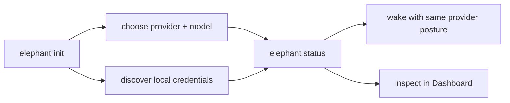

# Providers and models

Elephant Agent persists the provider shape and stores runtime secrets in the local
encrypted vault when you provide an override directly. Local Elephant Agent state keeps
the provider identity, base URL, active dialogue model, reasoning-effort
setting, context-window settings, and embedding bootstrap posture, but never
exports the secret value.

:::tip Provider setup is part of continuity
`wake` should be able to return to the same elephant without asking you to
re-explain which model, provider, and embedding path it should use.
:::

Elephant Agent can also discover reusable credentials from local operator state:

- environment variables such as `OPENAI_API_KEY`, `COPILOT_GITHUB_TOKEN`, or provider-specific API key aliases
- Codex credentials from `CODEX_HOME/auth.json` or `~/.codex/auth.json`
- Qwen OAuth credentials from `~/.qwen/oauth_creds.json`
- GitHub Copilot OAuth credentials from `COPILOT_GITHUB_TOKEN`, `GH_TOKEN`, `GITHUB_TOKEN`, or `gh auth token`
- GitHub Copilot ACP process availability from `COPILOT_ACP_BASE_URL` or a local `copilot` CLI
- local provider probes for `ollama` and `vllm`

## What Elephant Agent stores

| Provider concern | Stored locally? | Why |
| --- | --- | --- |
| Provider id and base URL | Yes | So `wake`, dashboard, cron, and messaging use the same runtime posture. |
| Active dialogue model | Yes | So conversations resume against the expected model family. |
| Reasoning effort | Yes, when supported | So model behavior stays intentional instead of accidental. |
| Context-window choice | Yes | So long-context posture can be inspected and changed. |
| Secret value | In encrypted local vault or discovered credential source | So secrets do not appear in docs, repo files, or support bundles. |
| Embedding provider posture | Yes | So memory search and recall use the configured local or remote path consistently. |



## Configure during `init`

The normal path is to choose the provider during `elephant init`.

If you want to script it:

```bash
elephant init --non-interactive \
  --elephant-name nova
```

You can also open `elephant init`, `elephant provider`, `/providers`, or `/models`
interactively and:

- reuse a discovered OAuth session without being forced through an API-key prompt
- paste a provider key or override token into the hidden input once when you do need to pin one
- reuse a credential source that Elephant Agent already discovered locally
- choose from the live provider catalog path, whether that provider exposes `/models`, `/v1/models`, or a provider-specific equivalent
- choose one dialogue model for `wake`; Elephant Agent keeps any internal fast lane aligned to that same model during the reset
- set reasoning effort when the selected model supports it
- keep the context window on auto-detect or override it manually
- inspect or switch the embedding path with `elephant provider embeddings status`, `elephant provider embeddings local`, or `elephant provider embeddings openai-compatible --base-url <url> --model <id> --dimensions <n>`

| Surface | Best for |
| --- | --- |
| `elephant init` | First setup, when provider choice is part of shaping the elephant. |
| `elephant provider` | Later provider repair or model changes from the CLI. |
| `/providers` | Chat TUI inspection without leaving the wake surface. |
| `/models` | Switching or confirming available dialogue models. |
| Dashboard Models | Visual inspection of provider and model readiness. |

## Manage the embedding path

The reset-era CLI exposes one active embedding selection only:

- the implicit local Elephant Agent embedding default
- one configured OpenAI-compatible override stored at the canonical active embedding config id

Use these commands:

```bash
elephant provider embeddings status
elephant provider embeddings local
elephant provider embeddings openai-compatible \
  --base-url https://api.example.com/v1 \
  --model text-embedding-3-large \
  --dimensions 1536 \
  --api-key "$OPENAI_API_KEY"
```

Selecting `local` deactivates the OpenAI-compatible override and falls back to
the built-in local embedding service.

See [Embeddings](../capacities/embeddings.md) for the product-level explanation
of local semantic recall, multilingual/hybrid/time-aware retrieval, and provider
override posture.

## Keep secrets out of repo files

| Do | Avoid |
| --- | --- |
| Let Elephant Agent keep runtime provider secrets in the encrypted local vault. | Pasting provider secrets into local Elephant Agent elephant files. |
| Rotate provider keys through `elephant provider` or `/providers`. | Committing secrets into repo files. |
| Use discovered local credential sources when available. | Copying live keys into support bundles or screenshots. |

## Re-check after changes

Whenever you change provider settings, rerun:

```bash
elephant status
```

That is the supported way to confirm the active elephant and provider posture are
ready for `wake`.

## Current provider catalog

Elephant Agent already ships these provider surfaces in the shared runtime:

- `openai-compatible`
- `openai`
- `openai-codex`
- `openrouter`
- `copilot`
- `anthropic`
- `claude-code`
- `google`
- `google-gemini-cli`
- `groq`
- `deepseek`
- `xai`
- `mistral`
- `together`
- `fireworks`
- `moonshot`
- `qwen-oauth`
- `minimax`
- `minimax-cn`
- `zai`
- `alibaba`
- `xiaomi`
- `huggingface`
- `opencode-zen`
- `opencode-go`
- `kilocode`
- `ollama`
- `vllm`

The product surface stays provider-neutral:

1. `init` stores the provider id, base URL, active dialogue model,
   reasoning-effort choice, context-window configuration, embedding bootstrap
   posture, and an encrypted local secret reference or discovered credential
   path.
2. `status` checks whether that install is ready to drive `wake`.
3. `wake` uses the same posture unless you deliberately change it.

Discovery-only providers such as `copilot-acp` are tracked in the provider
inventory even when runtime execution is intentionally disabled. That keeps the
operator view aligned with the local machine state without claiming a runtime
path that Elephant Agent cannot execute yet.
