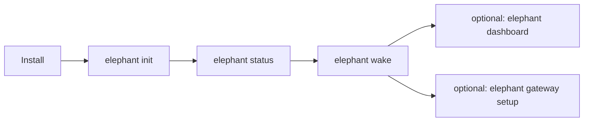

# Quickstart

After installation, stay in the CLI. The supported path is short on
purpose: set up identity once, create your first elephant, confirm readiness, and
come back to the same elephant through `wake` whenever you need it.

## Path overview



| Step | Command | Done when... |
| --- | --- | --- |
| Install | `curl -fsSL https://elephant.agentic-in.ai/install.sh \| bash` | `elephant` is on your `PATH`. |
| Initialize | `elephant init` | Your first elephant and provider posture exist. |
| Check readiness | `elephant status` | Provider and embedding readiness are clear. |
| Continue | `elephant wake` | You are in the durable chat surface. |

:::tip
After the first setup, `elephant wake` is the normal daily entrypoint.
:::

## 1. Run init

```bash
elephant init
```

`init` is the first-use setup flow. It:

- binds the local identity
- lets you choose a personality preset
- grows the first elephant with a clean Personal Model
- captures the active provider configuration before real conversations begin
- prepares the first named elephant so `wake` is the natural next step
- surfaces the IM handoff so `elephant gateway setup` can open the IM chooser without leaving the main setup flow

## 2. Confirm readiness

```bash
elephant status
```

Use `status` before the first durable conversation. It tells you whether the
active provider and local runtime posture are ready to go.

## 3. Enter `wake`

```bash
elephant wake
```

`wake` is the main conversational surface. That is where continuity stays
alive and your elephant keeps learning.

## Optional next steps

| If you want to... | Run | Read |
| --- | --- | --- |
| Inspect what Elephant Agent understands | `elephant dashboard` | [Dashboard](../user-interface/dashboard.md) |
| Wire a messaging app | `elephant gateway setup` | [Messaging](../capacities/messaging.md) |
| Install or inspect skills | `elephant skills` or `/skills` | [Skills](../capacities/skills.md) |
| Choose a provider or model | `elephant provider` or `/providers` | [Providers and models](./providers.md) |

### Wire IM

```bash
elephant gateway setup
```

Use this entrypoint when you want to choose an IM surface, configure it, or
inspect IM readiness without remembering the provider-specific setup commands.

## 4. Create another elephant only when you need one

```bash
elephant herd new nova
```

Each elephant is an isolated Elephant Agent individual with its own continuity line,
personality drift, and future `wake` history.

:::warning
Do not create a new elephant for every task. Create one when you want a separate
continuity line.
:::

## Optional: non-interactive setup

For scripted setup, you can preconfigure the provider path directly:

```bash
elephant init --non-interactive \
  --elephant-name nova \
  --provider-id openai-compatible
```

For deeper provider setup, continue with
[Providers and models](./providers.md).
