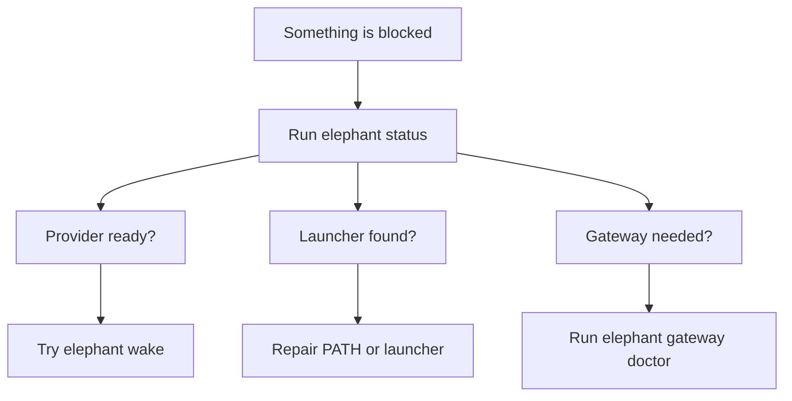

# Troubleshooting

Start with the checks that affect the whole local runtime: launcher, Python,
provider readiness, and durable state. Most issues show up in `elephant status`
before they show up in `wake`.

## First pass

| Symptom | Check first | Usually fixed by |
| --- | --- | --- |
| `elephant` is not found | `echo $PATH` | Add `~/.local/bin` to `PATH`. |
| Installer exits early | `python3 --version` | Use Python `3.12` or newer. |
| `wake` is blocked | `elephant status` | Repair provider, model, or embedding readiness. |
| Messaging does not connect | `elephant gateway doctor` | Re-run gateway setup and confirm account status. |
| Dashboard looks stale | `elephant dashboard` output | Restart the local dashboard process. |



## `elephant: command not found`

The installer writes the launcher to `~/.local/bin/elephant` by default.

Add that directory to `PATH`:

```bash
export PATH="$HOME/.local/bin:$PATH"
```

Then open a new shell.

## Python is too old

The public installer currently expects Python `3.12` or newer. Check it with:

```bash
python3 --version
```

If your default `python3` is older, rerun the installer with a newer interpreter:

```bash
curl -fsSL https://elephant.agentic-in.ai/install.sh | bash -s -- --python /path/to/python3.12
```

## `elephant status` says the provider is not ready

Usually this means the expected secret environment variable is not exported in
your current shell. Re-export it, then rerun:

```bash
elephant status
```

If the provider is configured but the model is missing, open `elephant provider`,
`/providers`, or the Dashboard Models page and choose the active model again.

:::warning Wake is intentionally gated
`wake` should not enter the chat surface when the provider posture is incomplete.
Fix readiness first so the same elephant can resume with predictable behavior.
:::

## I need to rewrite the launcher

For the public install path:

```bash
curl -fsSL https://elephant.agentic-in.ai/install.sh | bash -s -- upgrade
```

For a repo checkout:

```bash
bash scripts/install.sh upgrade
```

## I want to inspect the durable layout

Default locations:

| Area | Default path | Notes |
| --- | --- | --- |
| Runtime root | `~/.elephant` | Local home for Elephant Agent runtime state. |
| Herd | `~/.elephant/herd` | Durable elephant state and local continuity data. |
| Profile | `~/.elephant/profile` | Local operator profile material. |
| Skills root | `~/.elephant/skills` | Local skill workspace. |
| Installed skills | `~/.elephant/skills/installed` | Explicitly installed external skills. |
| Authored skills | `~/.elephant/skills/authored` | Local skill authoring area. |
| Built-in skills | Installed package | Shipped inside `packages/skills/builtin_packages/`. |

That is where Elephant Agent keeps the durable local posture between sessions. Built-in skills do not need to appear under `~/.elephant/skills` unless you explicitly install or author local copies.

## When to inspect deeper

| Need | Command or page |
| --- | --- |
| Confirm provider and embedding readiness | `elephant status` |
| See what the current elephant understands | Dashboard You page |
| Inspect saved elephants | Dashboard Herd page or `elephant herd` |
| Check messaging adapters | Dashboard Messaging page or `elephant gateway doctor` |
| Review background learning jobs | Dashboard Job and Reflect pages |
| Inspect conversation continuity | Dashboard History page |
