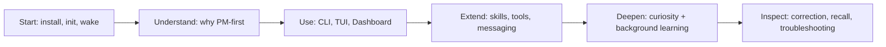

# Overview

Most AI starts from the task in front of it. Elephant Agent starts from the
person it is helping.

The bet is simple: personal AI should not win by keeping the longest transcript
or collecting the largest tool shelf. It should grow a **correctable
understanding** of the paths, people, risks, rhythms, and decisions that keep
shaping your work. That understanding should stay durable between sessions,
remain visible enough to inspect, and get better through gentle curiosity at the
pace you choose.

That is why Elephant Agent is **personal-model-first AI**. Memory is the
beginning, not the product. The center is a Personal Model: what Elephant Agent
currently understands about your **Identity**, **World**, **Pulse**, and
**Journey**, with source evidence and open questions close enough to correct.

:::tip Start here
If you only have a few minutes, install Elephant Agent, run `elephant init`, then
return through `elephant wake`. The same elephant should be able to pick up the
right thread because it is learning the path, not just replaying the transcript.
:::

## Choose your path

| If you want to... | Read this first | What you will understand |
| --- | --- | --- |
| Start using Elephant Agent | [Quickstart](./getting-started/quickstart.md) | The shortest supported path from install to `wake`. |
| Understand the thesis | [Why Elephant Agent](./philosophy/overview.md) | Why elephant-inspired memory means judgment from the right experiences, not more storage. |
| Learn the daily surfaces | [CLI / Chat TUI](./user-interface/cli-tui.md) | How `elephant`, `init`, `wake`, and slash commands fit together. |
| Inspect what it knows | [Dashboard](./user-interface/dashboard.md) | How You, Diary, Herd, Curiosity, Skills, Tools, Messaging, and Jobs map to the product model. |
| Extend what it can do | [Skills](./capacities/skills.md) and [Tools](./capacities/tools.md) | How visible capabilities orbit the Personal Model. |
| Understand learning | [Proactive curiosity](./learning/proactive.md) | How Elephant Agent asks gently, learns in the background, and stays correctable. |

## The core idea

| Product bet | What it means | Where to go deeper |
| --- | --- | --- |
| **Personal Model first** | Elephant Agent keeps an explicit, inspectable model of what it understands, rather than treating every retrieved memory as truth. | [Personal Model first](./philosophy/design-principles.md) |
| **Curious by design** | It does not wait for you to explain everything forever. It may ask when a missing or stale answer would change future help. | [Proactive curiosity](./learning/proactive.md) |
| **Correctable understanding** | Claims can be remembered, corrected, forgotten, disputed, and traced back to evidence. | [Correctable understanding](./learning/correctable.md) |
| **Continuity across surfaces** | CLI, Chat TUI, Dashboard, messaging, jobs, skills, tools, and recall all orbit the same local understanding system. | [Continuity](./capacities/continuity.md) |

## The docs map

## How Elephant Agent is organized

| Area | Product question | Main docs |
| --- | --- | --- |
| Personal Model | What does Elephant Agent understand about the person? | [Personal Model first](./philosophy/design-principles.md), [Memory](./capacities/memory.md) |
| Memory architecture | What becomes durable truth, what stays evidence, and what is recalled only for the current turn? | [System model](./philosophy/system-model.md), [Memory](./capacities/memory.md), [Embeddings](./capacities/embeddings.md) |
| Daily surfaces | Where do I talk to it, inspect it, and correct it? | [CLI / Chat TUI](./user-interface/cli-tui.md), [Dashboard](./user-interface/dashboard.md) |
| Visible capabilities | What can it reach for without becoming a feature shelf? | [Skills](./capacities/skills.md), [Tools](./capacities/tools.md), [Messaging](./capacities/messaging.md) |
| Learning loops | How does understanding deepen over time? | [Proactive curiosity](./learning/proactive.md), [Background learning](./learning/background.md), [Correctable understanding](./learning/correctable.md) |

## Design source of truth

These docs are the public operator guide. The deeper repository architecture
truth lives in the system-design docs and the paper:

- [System layer model](https://github.com/agentic-in/elephant-agent/blob/main/docs/system-design/system-layer-model.md)
- [Paper](/paper/) for the outward-facing technical report
