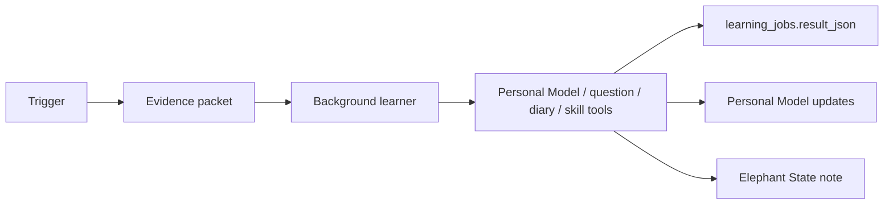

# Background learning

Not every useful update should happen inside the immediate reply. Some learning
is better after the conversation breathes.

Background learning lets Elephant Agent review source material, ask narrow
maintenance questions, refresh context notes, write diary-style summaries, and
update skill affinity through governed paths.

## Learning jobs

| Job family | What it does | Writes durable truth directly? |
| --- | --- | --- |
| Episode close | Reviews the just-finished runtime window. | No, it writes through Personal Model tools. |
| Diary | Produces a readable reflection of what Elephant Agent picked up. | No, it remains inspectable output unless promoted. |
| Dream | Consolidates long-running patterns and stale material. | No, it proposes or writes governed updates. |
| Grounding | Maintains identity, world, pulse, and journey anchors. | Only through explicit claim updates. |
| Skill affinity | Notices which skills fit the user or workflow. | No hidden skill profile; skills stay visible. |

## Lifecycle

:::note
Background learning is a lifecycle, not a second truth layer. It should preserve
the correction path and leave results inspectable.
:::

## What evidence goes in

| Evidence | Why it matters |
| --- | --- |
| Active Personal Model claims | The learner knows what is already understood. |
| Open questions | The learner avoids duplicating unresolved asks. |
| Episode Steps | The learner can cite source material. |
| Tool results | The learner can distinguish action from assumption. |
| User corrections | The learner respects explicit changes first. |

## Where to inspect it

- Dashboard **Reflect** for background jobs and learning summaries.
- Dashboard **Diary** for readable accumulated understanding.
- Dashboard **History** for the source trail behind a learning result.
- Dashboard **You** for the Personal Model claims that survived the process.

## Good background learning

Good background learning is quiet, bounded, and correctable:

- it does not invent durable claims from weak support
- it preserves provenance to source Steps
- it updates Personal Model claims through the same correction path as foreground edits
- it can return no update when nothing should be learned

