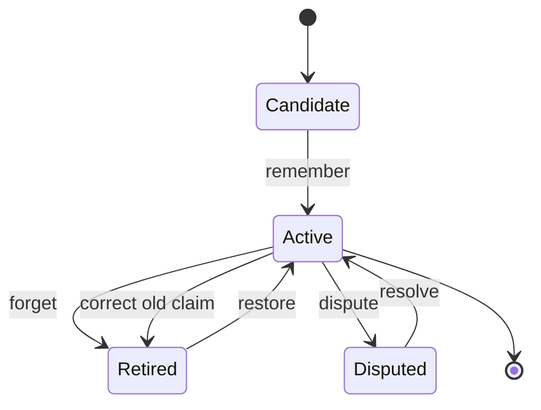
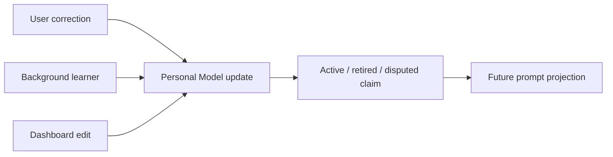

# Correctable understanding

Elephant Agent should become clearer over time, not more confident about stale
claims.

Correctability is the product contract that keeps personal AI from becoming a
hidden profiler. The user can remember, correct, forget, dispute, inspect, and
ask why.

## The correction moves

| Move | Intent | Result |
| --- | --- | --- |
| Remember | Carry a useful claim forward. | A new active Personal Model claim. |
| Correct | Replace a wrong or stale claim. | Old claim retires; corrected claim becomes active. |
| Forget | Stop using a claim. | Claim no longer shapes future replies. |
| Dispute | Mark uncertainty. | Elephant Agent avoids treating the claim as settled. |
| Explain why | Inspect support. | Source Episodes and Steps become visible. |

## Claim lifecycle

:::warning
A corrected claim should win over old recall. If current-turn recall finds a
stale Step, that Step can explain history, but it should not override the active
Personal Model.
:::

## No-match is a feature

`no_match` means Elephant Agent does not have reliable Personal Model support.
That is often the right answer.

| Search result | Good behavior |
| --- | --- |
| `strong_match` | Use the claim and keep the answer grounded. |
| `weak_match` | Avoid overclaiming; ask or qualify if needed. |
| `no_match` | Say the Personal Model does not contain support. |

## Foreground and background use the same path

Whether the update comes from chat, dashboard, init, or background learning, the
important rule is the same: durable understanding changes through explicit
Personal Model claim operations.

## Where to correct

| Surface | Best for |
| --- | --- |
| Chat / `wake` | Correcting naturally in conversation. |
| Dashboard You | Reviewing and correcting active claims. |
| Dashboard Curiosity | Answering or dismissing open questions. |
| Dashboard History / Why | Inspecting source support before changing a claim. |

