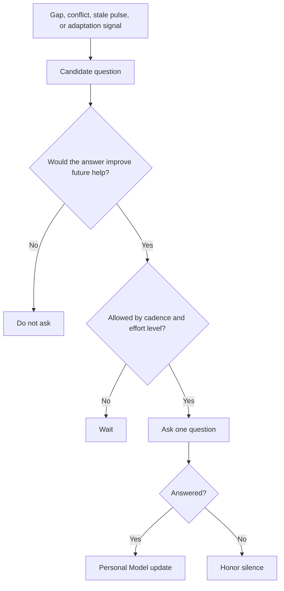

# Proactive curiosity

Elephant Agent is proactive about understanding, not pushy about action.

It may ask when a gap, conflict, stale Pulse, or adaptation signal would change
future help. The user chooses how curious the elephant should be, and silence is
honored.

## Curiosity levels

| Level | Behavior | Use it when... |
| --- | --- | --- |
| Quiet | Rare questions, mostly waits. | You want minimal interruption. |
| Balanced | Asks at natural pauses when the answer matters. | You want learning without pressure. |
| Active | More willing to check in, still optional. | You want the Personal Model to deepen faster. |

:::warning Not interrogation
Curiosity should never feel like a survey. Questions are one at a time, visible,
dismissible, and optional.
:::

## Lifecycle

## What a good question does

| Good question | Weak question |
| --- | --- |
| Tied to a lens/topic. | Broad personality survey. |
| Would change a future reply. | Nice-to-have trivia. |
| Easy to skip. | Implies obligation. |
| Visible in the Questions dashboard. | Hidden profiling signal. |
| Produces or corrects a claim. | Adds vague text to memory. |

## Where to inspect it

- Dashboard **Curiosity** shows open learning loops.
- `wake` can surface a question when the cadence allows.
- Answered questions can become Personal Model claims with provenance.
- Dismissed or ignored questions should not escalate into nagging.

