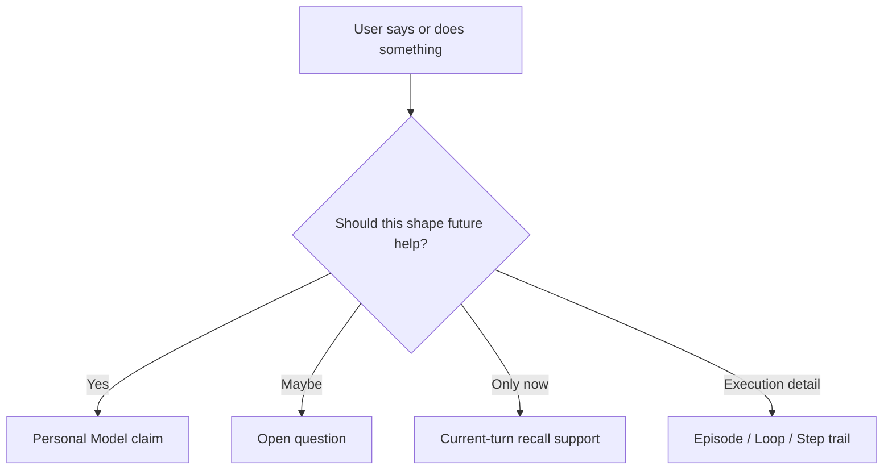

# Personal Model first

Elephant Agent starts from a person, not from a task. The Personal Model is the
object that makes that possible.

It is the durable understanding Elephant Agent can carry into future help:
stable enough to be useful, visible enough to correct, and small enough to avoid
turning every transcript into truth.

## The four lenses

| Lens | The question it answers | Should change when... |
| --- | --- | --- |
| **Identity** | Who is this person and how should Elephant Agent relate to them? | The user corrects names, language, role, boundaries, or stable preference. |
| **World** | What surrounds this person? | Projects, people, tools, locations, or operating context change. |
| **Pulse** | What is alive right now? | Priorities, pressure, energy, risks, or near-term focus shifts. |
| **Journey** | What has the path taught? | Decisions, lessons, repeated patterns, or long-running arcs become clear. |

:::tip
When in doubt, ask whether a claim should help future Elephant Agent replies
across multiple sessions. If not, it probably belongs in runtime history,
current-turn recall support, or a task tool instead.
:::

## What belongs in the model

| Candidate memory | Better owner | Reason |
| --- | --- | --- |
| "User prefers concise answers." | Personal Model | Stable response style signal. |
| "The current build is failing on one test." | Episode/Step or task tool | Live work state, not durable identity. |
| "User might be switching projects." | Question | Uncertain signal that should be asked, not assumed. |
| "A search result supported the answer." | Current-turn recall support | Evidence for this turn, not truth by itself. |

## The correction contract

The Personal Model must remain correctable. Public and technical surfaces should
make four moves feel natural:

| Move | Meaning | Product behavior |
| --- | --- | --- |
| Remember | Add a useful future-facing claim. | The claim can appear in future prompt projection. |
| Correct | Replace an outdated or wrong claim. | The old claim retires; the new one becomes active. |
| Forget | Retire a claim. | It should no longer shape replies. |
| Dispute | Keep uncertainty visible. | Elephant Agent avoids treating the claim as settled. |

:::warning Not a hidden profile
The Personal Model is not a secret behavioral score. The user should be able to
inspect claims, see support, answer or dismiss questions, and correct what does
not fit.
:::

## Why capabilities orbit the model

Skills, tools, models, messaging, jobs, and embeddings all matter. But they do
not replace the center.

| Capability | What it adds | How it stays grounded |
| --- | --- | --- |
| Skills | Repeatable workflows. | Skill affinity can be learned, but the user can inspect and toggle skills. |
| Tools | Action and retrieval. | Tool use records Steps and can update claims only through explicit paths. |
| Models | Dialogue and reasoning. | Provider choice changes how Elephant Agent thinks, not what is true. |
| Messaging | More surfaces. | The same elephant owns the continuity line. |
| Background jobs | Learning outside the immediate reply. | Jobs write through Personal Model tools, not a second hidden memory. |
