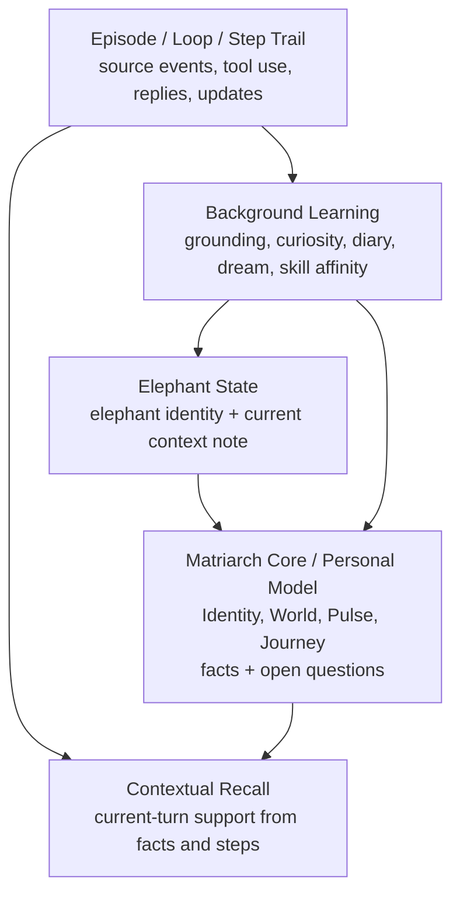
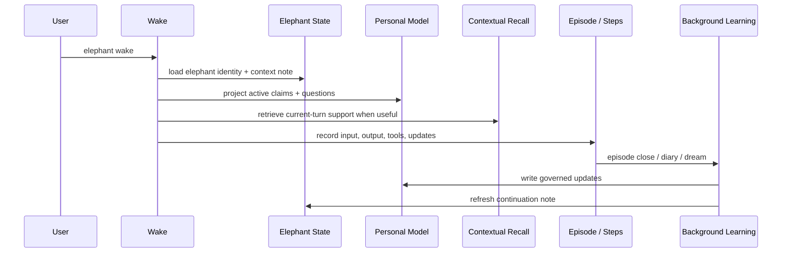

# System model

Elephant Agent is an **Understanding System**. It remembers through layers, each
with a different owner and lifetime.

## The five-layer model

| Layer | Owns | Lifetime | Should contain |
| --- | --- | --- | --- |
| **Matriarch Core / Personal Model** | Durable understanding. | Across sessions and surfaces. | Active facts, retired/disputed claims, open questions. |
| **Elephant State** | The elephant identity and one continuation note. | Across wakes for one elephant. | `elephant_id`, name, identity text, current context note. |
| **Episode / Loop / Step Trail** | Raw lived trace and provenance. | Audit and learning history. | Inputs, replies, tool calls, tool results, updates. |
| **Contextual Recall** | Support for the current turn. | Current turn only. | Retrieved claims or Step evidence with match status. |
| **Background Learning** | Slow maintenance of understanding. | Scheduled or lifecycle-triggered. | Episode close, diary, dream, grounding, skill affinity. |

:::note
Contextual recall is not discarded as "just recall." It is one layer of the
memory architecture. It can retrieve support, but it does not become durable
truth unless a governed update writes through the Personal Model.
:::

## Runtime flow

## Claim-aware search

Personal Model search returns claims, not generic note chunks. It can use:

| Signal | Purpose |
| --- | --- |
| Topic keys | Find exact known claim slots. |
| Exact text | Respect precise names, phrases, or values. |
| Unicode lexical and CJK n-grams | Support multilingual and mixed-language matching. |
| Semantic retrieval | Recover meaning when wording changes. |
| Query variants | Let the model provide translated or paraphrased variants. |
| Verification mode | Require stronger support before using a claim. |

Search returns `strong_match`, `weak_match`, or `no_match`, so Elephant Agent can
avoid inventing support when the Personal Model does not contain reliable
understanding.

## Prompt projection

The stable prompt should contain only what Elephant Agent can responsibly carry:

- elephant identity and current context note
- active Personal Model claims
- compact tool and behavior policy
- current-turn recall support only when useful

For the canonical repository design reference, see
[`docs/system-design/system-layer-model.md`](https://github.com/agentic-in/elephant-agent/blob/main/docs/system-design/system-layer-model.md).
