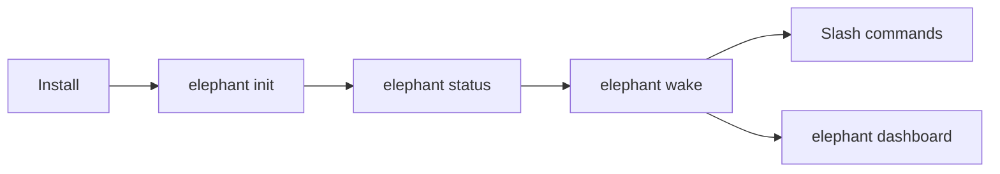

# CLI / Chat TUI

The CLI is the front door. The chat TUI is where the same elephant keeps the
thread alive.

Elephant Agent should feel local, inspectable, and calm: one command to start,
one wake surface to continue, and slash commands when you need to inspect the
runtime without leaving the conversation.

## Core flow

| Step | Command | What it does |
| --- | --- | --- |
| Install | `curl -fsSL https://elephant.agentic-in.ai/install.sh \| bash` | Writes the launcher and local runtime. |
| First shape | `elephant init` | Creates identity, first elephant, provider posture, and curiosity defaults. |
| Readiness | `elephant status` | Confirms model, provider, embedding, and active elephant readiness. |
| Continue | `elephant wake` | Opens the durable chat surface for the current elephant. |
| Inspect | `/status`, `/memory`, `/tools`, `/skills` | Keeps runtime state visible inside the TUI. |

:::tip
Most days should start with `elephant wake`, not with a new setup flow. `wake`
returns to the active elephant and projects the current Personal Model into the
conversation.
:::

## What `init` creates

`elephant init` is not just a configuration wizard. It gives the first elephant
enough shape to begin learning responsibly.

| Init area | Why it exists |
| --- | --- |
| Identity | Gives the elephant a name and relationship posture. |
| Provider | Confirms where dialogue and reasoning come from. |
| Embeddings | Confirms local recall or an explicit override. |
| Curiosity | Sets how willing Elephant Agent is to ask. |
| First elephant | Creates the continuity line `wake` will return to. |

## Wake as the main surface

Inside `wake`, the conversation is primary. Tools, skills, models, memory, and
providers stay close but do not become the product center.

| Need | Slash command | Dashboard counterpart |
| --- | --- | --- |
| Check readiness | `/status` | Overview / Settings |
| Inspect understanding | `/memory` | You, Diary, Why views |
| Inspect tools | `/tools` | Tools |
| Inspect skills | `/skills` | Skills |
| Change provider/model posture | `/providers`, `/models` | Models / Providers |
| Messaging setup | `/gateway` | Messaging |
| Scheduled work | `/cron` | Jobs |

## Local-first posture

:::note Local runtime
Elephant Agent runs as a local runtime. The CLI, TUI, dashboard, gateway, cron,
and local state all resolve back to the same Elephant Agent home.
:::

The TUI is designed around three promises:

- **continuity** — the same elephant can resume later
- **inspection** — the important surfaces have slash commands or dashboard pages
- **correction** — when understanding is wrong, update the Personal Model rather
  than teaching a hidden profile

## When to use what

| Surface | Use it when... |
| --- | --- |
| `elephant` | You want the landing and next-step guidance. |
| `elephant init` | You are setting up this install for the first time. |
| `elephant wake` | You want to continue with the current elephant. |
| `elephant wake --message "..."` | You want a single non-interactive turn. |
| `elephant dashboard` | You want to inspect or correct understanding visually. |
| `elephant gateway setup` | You want Elephant Agent to meet you in messaging apps. |

