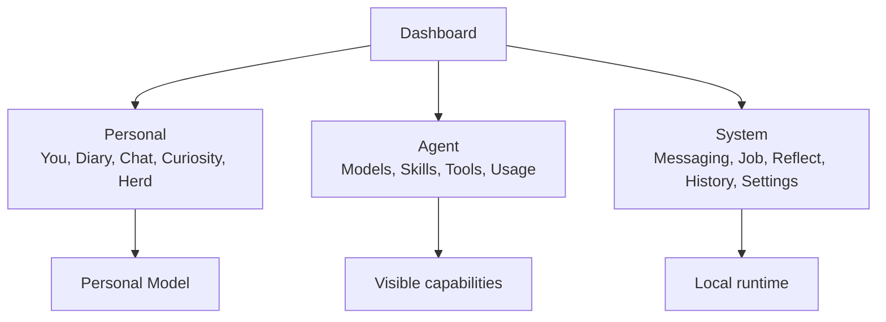
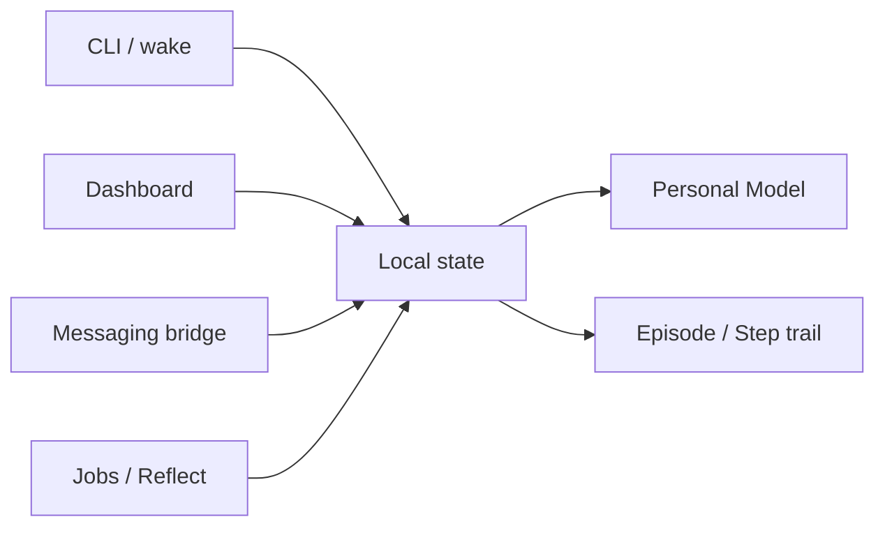

# Dashboard

The Dashboard is the visual inspection surface for a local Elephant Agent
runtime. It is not a hosted control plane. It reads the same local state that
`elephant wake`, messaging, jobs, and background learning use.

## The dashboard matrix

The dashboard groups pages into a practical capability matrix. The docs use a
journey-first order, but the dashboard is intentionally organized around what
you may need to inspect.

| Dashboard group | Pages | What it answers |
| --- | --- | --- |
| **Personal** | You, Diary, Chat, Curiosity, Herd | What does Elephant Agent understand, ask, and return to? |
| **Agent** | Models, Skills, Tools, Usage | What can this elephant think with, reach for, and spend? |
| **System** | Messaging, Job, Reflect, History, Settings | What local surfaces and background processes are active? |

## Personal pages

| Page | Use it for | Related docs |
| --- | --- | --- |
| **You** | Inspect active Personal Model claims by lens. | [Personal Model first](../philosophy/design-principles.md) |
| **Diary** | Read what Elephant Agent has picked up so far. | [Background learning](../learning/background.md) |
| **Chat** | Continue a focused dashboard conversation. | [CLI / Chat TUI](./cli-tui.md) |
| **Curiosity** | See what Elephant Agent may ask and why. | [Proactive curiosity](../learning/proactive.md) |
| **Herd** | Open, edit, or switch named elephants. | [Continuity](../capacities/continuity.md) |

:::warning Correctability matters
The dashboard should make wrong understanding visible. If a fact is stale,
correct or forget the Personal Model claim rather than trying to bury the issue
in a later prompt.
:::

## Agent pages

| Page | Use it for | Provenance rule |
| --- | --- | --- |
| **Models** | Choose dialogue and reasoning providers. | Provider choice changes how Elephant Agent thinks, not what is true. |
| **Skills** | Inspect and toggle workflow packages. | Skills are visible capabilities around understanding. |
| **Tools** | Inspect built-in and MCP tool surfaces. | Tool use records Steps and can update claims only through explicit paths. |
| **Usage** | Review tokens, models, and trends. | Usage is a ledger, not a quality score. |

## System pages

| Page | Use it for | Provenance rule |
| --- | --- | --- |
| **Messaging** | Connect Feishu, Discord, WeChat, and other adapters. | Messaging extends one elephant; it does not create a second memory. |
| **Job** | Schedule local prompts and system jobs. | Jobs should stay visible and pausable. |
| **Reflect** | Inspect background learning jobs. | Reflect writes through Personal Model tools. |
| **History** | Read conversation and runtime trails. | History is provenance and replay material, not truth by itself. |
| **Settings** | Adjust local preferences and runtime edges. | Settings should not hide durable understanding. |

## How dashboard and CLI fit together

Use the CLI when you want to work. Use the dashboard when you want to inspect,
correct, or understand what happened.

